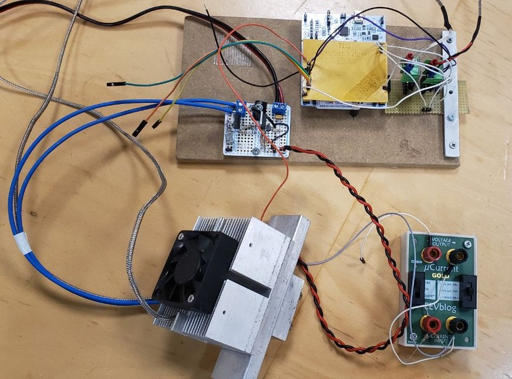

# Thermoelectric generator (TEG) characterization

These are the general steps to setup the characterization.

1. Connect everything as specified in the [schematics](./schematics/README.md)
2. [Build and flash the code](./nucleo-board/README.md) on the STM32, there you have the instructions to setup the development environment
3. Compile and open the desktop [application](./app/README.md) and do your experiments
4. Characterize and compare your TEG with [matlab code](./matlab/README.md)

> Before starting the suggestion is to read the project report (in folder **paper/**), then read all the README.md, and finally try experimenting.



## Compile the LaTex projets

In this repo there are the latex project of the report and the presentation.  

To compile the LaTex projects to pdf file, you can use the command `latexmk` after you correctly installed the LaTex toolchain for your Linux distribution.

``` bash
latexmk -pdf main.tex # in presentation directory
latexmk -pdf tegc.tex # in the paper directory
```

