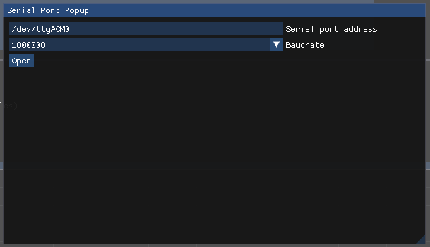

# GUI Application
Developed in C++, allows to connect to microcontroller to change its behaviour, to plot and save its data.

# Compiling
This folder contains a Makefile, here there are some scripts to compile the application.

## Prerequisites
Be sure to have cloned the repo with all the submodules, if not, then do the following:
```bash
git submodule update --recursive --init
```
This should clone all the submodules to the correct version.

### Linux
```bash
sudo apt install build-essential cmake libglfw3 libglfw3-dev libglew-dev
```

### Mac
```bash
brew install cmake glfw glew
```

## Compilation

```bash
make release
```

The compiled application is located in **bin/** folder.

# Application walkthrough
## Connect
It was created to connect to a microcontroller, so the initial thing to do is to connect with a USB.
Choose the correct port path and click open.


The baudrate is already the same as the microcontroller.

After opening the port the ui should be like this:


## Reset micro
The micro sends measured data in csv format every 100ms, however the header of that CSV is sent only once, so after connecting to the application you should reset the microcontroller such that the received CSV data are parsed correctly.

## Top section (Log file)
Allows to open a file to save CSV data. One should open one file per log session. Before opening the file be sure to have received the header from the microcontroller (explained [here](#reset-micro))!

## Middle section (Commands)
Here the command section allows to send parameters to the microcontroller.
Choose a command in **Command preset**. A hint on how to use it should apper right below, then complete the command in **Command** text box and then press *Enter* to send to the micro.
The result (if there is) will appear in **lines not parsed** text box.

To check all the available commands the suggestion is to have a look at the microcontroller code, in that way is always updated and the intention of the specific command is clearer. The code responsible is in `nucle-board/Core/Src/main.c` in `parse_uart_line` function.

## Plot
This bottom section allows to plot CSV columns received by the micro.
One can add multiple lines changing both x and y.


In this image there are two plots, the first is configured as having two lines both with **time** on x-axis, then two y values: **temp_delta** and **teg_current**.  
The second plot has an x-y plot where on x-axis there is **temp_delta** and on y-axis the **teg_oc_voltage**. This second plot allows to view the seebeck effect in action!

> :warning: Only CSV columns can be plotted, be sure to spell them correclty!

# Log TEG data
In steps:
1. Connect USB
2. Reset microcontroller and check that the table is filled correctly
3. Check in plots that all sensors are reading correctly
4. Change output file name (at the top) to match the experiment type
5. Open the file
6. Send "setpoint" command with the desired hot side temperature that should be reached
7. Check in the plots when that temperature is reached
8. Iterate on steps 6 and 7

The first times test the application with small logs, so that is somethig wrong happens no data is lost.
