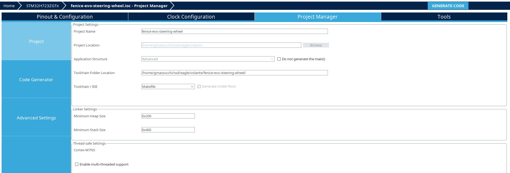
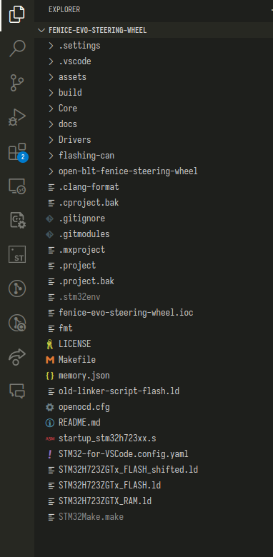
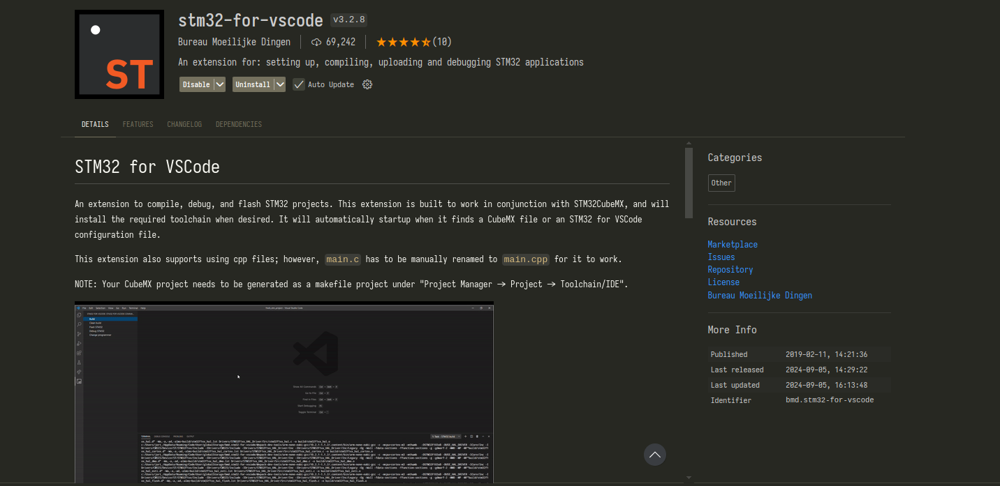

# Compiling and flashing the firmware on STM32

This is the procedure to setup the development environment for the STM32 firmware.

- Download STM32 CubeMX from the [official link](https://www.st.com/en/development-tools/stm32cubemx.html) and install it
- Open the file `nucleo-board/tegc.ioc`
- Once opened the project, go to "Project Manager" and click on "GENERATE CODE".

- Open the `nucleo-board` folder in vscode

- Install the STM32 VsCode Extension.

- On the left you should see the extension logo, select it and click on "install build tools", then leave it some time for installation
- After installation you should see on the same place "Build", "Clean build", "Flash", etc...
- Click on build and verify that it builds correctly
- Then connect the nucleo board and verify that it flashes correctly

